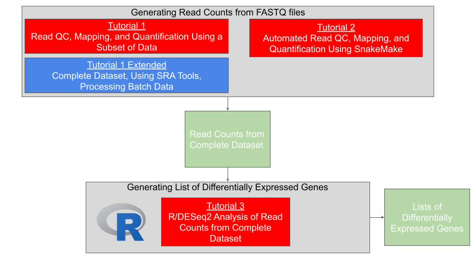

[comment]: <> (Hi. If you are seeing this message, please open this file with markdown preview or jupyter notebook. You can do this by right clicking on the readme file and picking 'open with'.)

# Maine INBRE Cloud Training Tutorials

## Contents

[Overview](#overview)
[Requirements](#requirements)    
[Workflows](#workflows)  
[Data](#data)  
[Support Forum Thanks](#support-forum-thanks)  
[Funding](#funding)  
[License for Data](#license-for-data)  

## Overview

Included here are several tutorials in the form of 'Jupyter notebooks'.

The purpose of these tutorials is to help users familiarize themselves with the cloud computing in the specific context of running bioinformatics workflows. Here is a link to a [YouTube video](https://youtu.be/3ie420Luorc) that gives you an overview of the tutorials.

These tutorials do this by going step-by-step through specific workflows. These workflows cover the start to finish of basic bioinformatics analysis; starting from downloading raw sequence data, and extending to differential gene expression analysis, and producing common plots in R.   

## Requirements

These tutorials were designed to be used on cloud computing platforms, with the aim of requiring nothing but the files within this GitHub repository.

With this in mind, our tutorials use Jupyter Notebook files, which Google Cloud Platform, Amazon Web Service, and Microsoft Azure all provide support for. Therefore, requirements should only require creation of a virtual machine on one of these providers, and the downloading of this github's files to that machine.

For more information on creating a virtual machine and downloading our GitHub repo to that machine, we have a getting started section in each folder in running notebooks in AWS or Google Cloud platform.

## Workflows

Our tutorials are broken down into 'workflows'. Each notebook file covers a specific workflow, which contains written and visual commentary, as well as the actual step-by-step code for running that workflow analysis. 

These notebooks were designed to be run using a virtual machine on a cloud computing provider. For more information on how to do this; navigate to the [Getting Started](#getting-started) section. Feel free to explore and run the workflows in any order you like. 

**[Workflow One](Tutorial_1.ipynb):** A short introduction to downloading and mapping sequences to a transcriptome using Trimmomatic and Salmon. Here is a link to the YouTube video demonstrating the tutorial: <https://youtu.be/ChGfBR4do_Y>.

**[Extended Workflow One](Tutorial_1B_Extended.ipynb):** An extended version of workflow one. Once you have got your feet wet, you can retry workflow one with this extended version that covers the entire dataset, and includes elaboration such as using SRA tools for sequence downloading, and examples of running batches of fastq files through the pipeline. This workflow may take around an hour to run.

**[Workflow One (Using Snakemake)](Tutorial_2_Snakemake.ipynb):** Using Snakemake to run workflow one.

**[Workflow Two (DEG Analysis)](Tutorial_3_DEG_Analysis.ipynb):** Using Deseq2 and R to conduct clustering and differential gene expression analysis.

**[Workflow three (Using Snakemake with Life Sciences API)](Tutorial_4_Snakemake_LS_API.ipynb):** Using Snakemake to run workflow three.

**[Workflow three (Using Nextflow and Google Batch)](Tutorial_4_Nextflow_GBatch.ipynb):** Using Nextflow to run workflow three.

**[Bonus](Tutorial_5_BonusNotebook.ipynb):** Test your knowledge by filling in the blanks for key Cloud and bioinformatic tasks learned in the other submodules.

## Data

These tutorials use example sequence data procured from the Sally Molloy labratory here at University of Maine; which investigates the transcriptome change in prophage infected, versus non-prophage infected *M. chelonae* bacteria. The respective article can be found [here](https://www.ncbi.nlm.nih.gov/pmc/articles/PMC8191103/).

## Support Forum Thanks

Support forum thanks. For almost any programming project, contributions to online databases and support forums are an invaluable resource that are heavily leaned upon. Thank goodness for those people who take the time to answer silly questions.

## Funding

Funded by the Maine INBRE Program (NIH/NIGMS P20 GM103423).

## License for Data

Text and materials are licensed under a Creative Commons CC-BY-NC-SA license. The license allows you to copy, remix and redistribute any of our publicly available materials, under the condition that you attribute the work (details in the license) and do not make profits from it. More information is available [here](https://tilburgsciencehub.com/about).

This work is licensed under a [Creative Commons Attribution-NonCommercial-ShareAlike 4.0 International License](http://creativecommons.org/licenses/by-nc-sa/4.0/)

